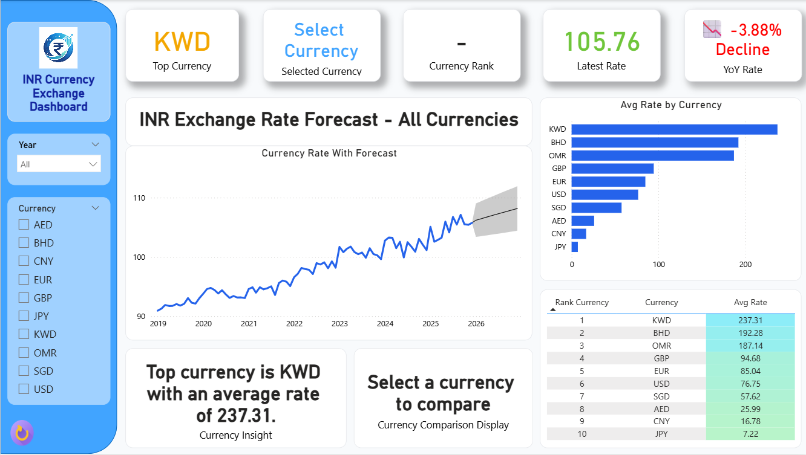

# 💱 INR Currency Exchange Analysis Dashboard

## 📌 Project Overview
This project presents an interactive **Power BI dashboard** analyzing the exchange rate trends of INR (Indian Rupee) against multiple global currencies.

The dashboard focuses on currency fluctuations, yearly trends, and comparative performance using dynamic visuals and DAX-driven insights.

---

## 📊 Key Features

- 📈 Year-wise exchange rate trend analysis  
- 🌍 Multi-currency comparison (USD, EUR, GBP, etc.)  
- 📉 YoY (Year-over-Year) growth analysis  
- 🎯 Dynamic filtering using slicers (Year & Currency)  
- 🧾 Detailed tabular view with conditional formatting  
- 🧠 Insight cards showing currency strength/weakness  

---

## 🧠 Insights Generated

- Identification of strengthening and weakening currencies over time  
- Clear understanding of INR performance against global currencies  
- Detection of trends and fluctuations in exchange rates  
- Comparative analysis using YoY percentage changes  

---

## 🧰 Tools & Technologies

- **Power BI**  
- **DAX (Data Analysis Expressions)**  
- Data Modeling  
- Data Visualization  

---

## 📁 Dataset Information

The dataset contains historical exchange rate data of INR against multiple currencies with the following fields:

- Currency  
- Date (Year & Month)  
- Exchange Rate (INR vs Currency)  

> The dataset is structured to simulate real-world currency trends for analytical and visualization purposes.

---

## 📸 Dashboard Preview

---

## 🚀 Getting Started

1. Download the `.pbix` file from this repository  
2. Open it using Power BI Desktop  
3. Use slicers to explore different currencies and years  

---

## 💡 Key Learnings

- Creating dynamic measures using DAX  
- Implementing YoY calculations  
- Designing clean and interactive dashboards  
- Generating insights using data visualization  

---

## ⭐ Acknowledgement

This project is created for learning and portfolio purposes to demonstrate data analysis, DAX skills, and dashboard design using Power BI.