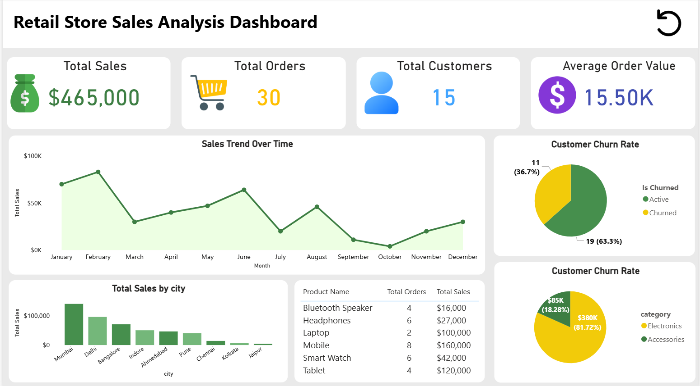

# 🛒 Retail Store Sales Analysis Dashboard

## 📊 Project Overview
This project presents a **Retail Store Sales Analysis Dashboard** built to analyze sales performance, customer behavior, and product trends. The dashboard provides actionable insights to support data-driven decision-making.

---

## 📌 Key Metrics
- 💰 Total Sales: $465,000  
- 🛍 Total Orders: 30  
- 👥 Total Customers: 15  
- 📈 Average Order Value: $15.50K  

---

## 📉 Dashboard Insights

### 🔹 Sales Trend Analysis
- Visualizes monthly sales performance
- Helps identify peak and low sales periods

### 🔹 Customer Churn Analysis
- Tracks active vs churned customers
- Helps understand customer retention

### 🔹 Sales by City
- Identifies top-performing cities
- Useful for regional strategy planning

### 🔹 Product Performance
- Displays total orders and sales by product
- Highlights best-selling products

### 🔹 Category Contribution
- Compares sales between categories (Electronics vs Accessories)

---

## 🛠 Tools & Technologies Used
- **Power BI** (Dashboard Creation)
- **SQL (Basic)** (Data Handling Concepts)

---

## 🎯 Objectives
- Analyze retail sales performance
- Identify trends and patterns
- Understand customer behavior
- Support business decision-making with data

---

## 📷 Dashboard Preview

---

## 🚀 What I Learned
- Data visualization techniques
- Building interactive dashboards
- Extracting insights from raw data
- Presenting business-focused analytics

---

## 📬 Contact
If you’d like to connect or see more projects:

📧 Email: gwability@gmail.com
💼 LinkedIn: [text](https://www.linkedin.com/in/tanna-herit-38b679387/)

---

## ⭐ Feedback
Feel free to give feedback or suggestions to improve this project!