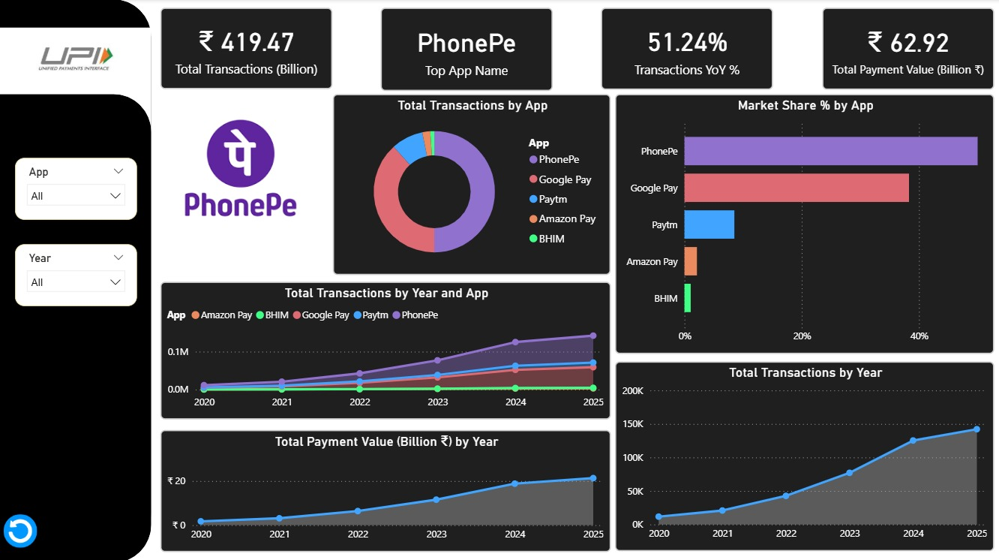

# 💳 UPI Payment Apps Analysis Dashboard

## 📌 Project Overview
This project presents an interactive **Power BI dashboard** analyzing the performance of major UPI payment applications in India.

The dashboard focuses on transaction trends, market share distribution, and growth patterns across different apps over time.

---

## 📊 Key Features

- 📈 Transaction trend analysis (Year-wise)
- 📊 App-wise comparison of transactions
- 🍩 Market share distribution
- 📉 Growth analysis using YoY metrics
- 🎯 Dynamic filtering using slicers (App & Year)

---

## 🧠 Insights Generated

- Dominance of leading UPI apps in the market
- Rapid growth in digital transactions over recent years
- Variation in market share across applications
- Clear trend of increasing adoption of UPI payments

---

## 🧰 Tools & Technologies

- **Power BI**
- **DAX (Data Analysis Expressions)**
- Data Modeling
- Data Visualization

---

## 📁 Dataset Information

The dataset contains structured transactional data of UPI applications with the following fields:

- App Name  
- Date (Year & Month)  
- Transactions (in Millions)  
- Payment Value (₹)  

> The dataset is designed to reflect realistic transaction trends for analytical and visualization purposes.

---

## 📸 Dashboard Preview

---

## 🚀 Getting Started

1. Download the `.pbix` file from this repository  
2. Open it using Power BI Desktop  
3. Use slicers to interact with the dashboard  

---

## ⭐ Acknowledgement

This project is created for learning and portfolio purposes to demonstrate data analysis and visualization skills using Power BI.
=======
# Data-Analytics-Portfolio
